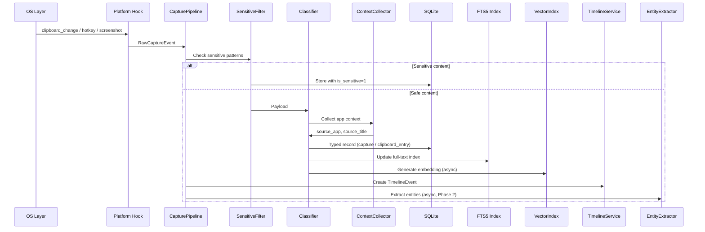

# Capture Pipeline

The ingestion backbone of AuraOS. Every feature that captures data flows through this pipeline.

## Overview

The Capture Pipeline transforms raw OS events (clipboard changes, hotkeys, screenshots) into typed, indexed, searchable records with timeline events.



## Event Sources

| Source | Trigger | Event Type | Phase |
|--------|---------|------------|-------|
| Clipboard monitor | OS copy event | `ClipboardChange` | 1 |
| Global hotkey `Ctrl+Shift+A` | User action | `ManualCapture` | 1 |
| Global hotkey `Ctrl+Shift+S` | User action | `Screenshot` | 1 |
| Global hotkey `Ctrl+Shift+T` | User action | `QuickNote` | 1 |
| Voice recorder | User action | `VoiceNote` | 3 |
| Git hook | Post-commit | `GitCommit` | 3 |
| Browser extension | Page visit | `BrowserVisit` | 3 |
| VSCode extension | Save snippet | `CodeSnippet` | 3 |

## Pipeline Stages

### 1. Platform Hook

OS-specific listeners that emit `RawCaptureEvent`:

```rust
struct RawCaptureEvent {
    source: EventSource,       // Clipboard | Hotkey | Screenshot | External
    payload: Payload,          // Text | Image | UserInput
    timestamp: DateTime<Utc>,
}

enum Payload {
    Text(String),
    Image(Vec<u8>),
    UserInput(CaptureRequest),
    External(ExternalEvent),
}
```

**Platform implementations:**

| Platform | Clipboard | Hotkey | Screenshot |
|----------|-----------|--------|------------|
| Linux | `arboard` / clipboard portal | `tauri-plugin-global-shortcut` | `screenshots` crate |
| macOS | `NSPasteboard` change count | Carbon/Cocoa event tap | `screencapture` |
| Windows | `AddClipboardFormatListener` | `RegisterHotKey` | GDI BitBlt |

### 2. Sensitive Filter

Runs before any storage or indexing. See [Clipboard Timeline](../features/clipboard-timeline.md).

```rust
fn is_sensitive(text: &str) -> bool {
    SENSITIVE_PATTERNS.iter().any(|p| p.is_match(text))
        || is_from_password_manager()
        || is_high_entropy_secret(text)
}
```

Sensitive content:
- Stored with `is_sensitive = 1`
- Excluded from FTS, vector index, and LLM context
- Visible only in Vault (Phase 2)

### 3. Classifier

Determines record type and routes to correct table:

| Input | Classification | Output Table |
|-------|---------------|--------------|
| Clipboard text | Automatic | `clipboard_entries` |
| Manual: Note | User-selected | `captures` (type=note) |
| Manual: Trade | User-selected | `captures` (type=trade) |
| Manual: Screenshot | User-selected | `captures` + `screenshots` |
| Manual: Idea | User-selected | `captures` (type=idea) |
| Manual: Task | User-selected | `tasks` |
| Manual: Bookmark | User-selected | `captures` (type=bookmark) |

**MVP classification:** Rule-based (user selection for manual, auto for clipboard).

**Phase 2:** ML-assisted — infer type from content (e.g., URL → bookmark, code → snippet).

### 4. Context Collector

Attaches ambient context to every capture:

```rust
struct CaptureContext {
    source_app: String,        // "Code", "Chrome", "Terminal"
    source_title: String,      // Window title
    clipboard_buffer: Option<String>,
    project_id: Option<String>, // Inferred or explicit
    timestamp: DateTime<Utc>,
}
```

**App detection:** `active-win-pos-rs` or platform equivalent.

**Project inference (Phase 2):**
- Match window title against known project keywords
- Match active app against project-app mappings
- Recent project from user activity

### 5. Storage

Write to SQLite in a single transaction:

```rust
fn process_capture(event: RawCaptureEvent) -> Result<()> {
    let ctx = collect_context()?;
    let record = classify(event, ctx)?;

    db.transaction(|tx| {
        let id = insert_record(tx, &record)?;
        create_timeline_event(tx, &record, &id)?;
        update_fts(tx, &record)?;
        Ok(id)
    })?;

    // Async (non-blocking)
    spawn_embedding(record.id);
    spawn_entity_extraction(record.id);  // Phase 2

    Ok(())
}
```

### 6. Indexing

**FTS5 (synchronous):** Updated in the same transaction as the record insert.

**Vector embedding (async):** Generated in background thread after save:

```rust
async fn generate_embedding(capture_id: &str, content: &str) {
    let embedding = embed_model.encode(content).await;
    vec_index.insert(capture_id, embedding);
}
```

### 7. Timeline Event Creation

Every capture creates a `TimelineEvent`. See [Timeline](../features/timeline.md).

```rust
fn create_timeline_event(record: &Record) -> TimelineEvent {
    TimelineEvent {
        event_type: record.event_type(),
        timestamp: record.created_at,
        title: generate_title(record),
        summary: generate_summary(record),
        content_ref: record.id,
        content_table: record.table_name(),
        source_app: record.context.source_app,
        metadata: record.display_metadata(),
    }
}
```

### 8. Entity Extraction (Phase 2)

Async LLM call to extract entities and links. See [Knowledge Graph](../features/knowledge-graph.md).

## Dedup Logic (Clipboard)

```rust
fn should_store_clipboard(text: &str, hash: &str) -> bool {
    if recent_duplicate(hash, Duration::seconds(5)) {
        return false;  // OS double-fire
    }
    if same_hash_within(hash, Duration::hours(1)) {
        return false;  // Re-copy within hour
    }
    true
}
```

## Error Handling

| Error | Behavior |
|-------|----------|
| DB write failure | Retry 3x, then queue for later |
| Embedding failure | Log warning, record saved without vector |
| Screenshot file write failure | Alert user, don't create record |
| Sensitive filter false positive | User can unmark in Vault |
| Platform hook crash | Restart hook, log error |

## Performance Targets

| Stage | Target |
|-------|--------|
| Hook → Filter | < 10ms |
| Filter → DB write | < 50ms |
| Total (sync path) | < 100ms |
| Embedding (async) | < 200ms |
| Entity extraction (async) | < 2s |

## Monitoring

Logged metrics (debug mode):

- Events received per source per minute
- Filtered (sensitive) count
- Dedup skipped count
- Average pipeline latency
- Embedding queue depth

## Phase

| Capability | Phase |
|------------|-------|
| Clipboard + manual capture pipeline | 1 |
| Screenshot pipeline | 1 |
| Sensitive filtering | 1 |
| Dedup | 1 |
| ML classification | 2 |
| Entity extraction | 2 |
| External sources (git, browser, VSCode) | 3 |
| Voice note pipeline | 3 |

## Related Docs

- [Universal Capture](../features/universal-capture.md)
- [Clipboard Timeline](../features/clipboard-timeline.md)
- [Timeline](../features/timeline.md)
- [Data Model](data-model.md)
- [Architecture Overview](overview.md)
