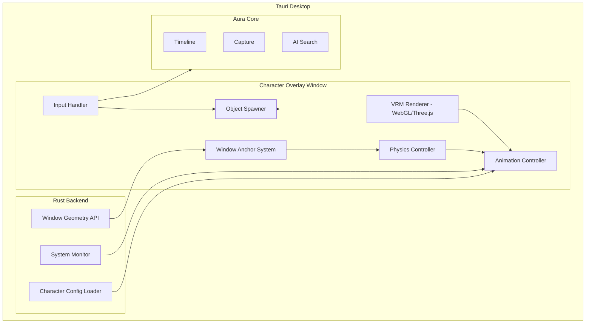
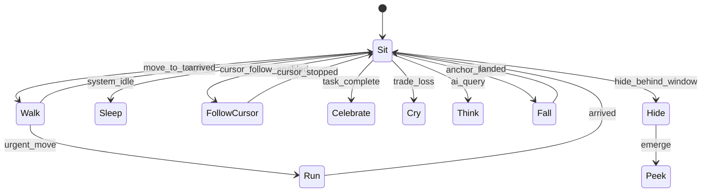

# Character Engine

**Phase 1 — Technical Architecture**

The rendering, physics, and interaction runtime that powers all Aura companions.

## Overview



The character renders in a **transparent, always-on-top Tauri window** that covers the full desktop (or per-monitor). Input passes through except on character and spawned objects.

## VRM Rendering

### Stack

| Component | Choice | Rationale |
|-----------|--------|-----------|
| 3D runtime | Three.js | VRM ecosystem, WebGL in Tauri webview |
| VRM loader | `@pixiv/three-vrm` | Standard VRM 0.x/1.0 support |
| Animation | `@pixiv/three-vrm-animation` + custom | VRM animation + procedural |
| Window | Transparent Tauri overlay | Per-monitor fullscreen transparent |

### VRM Model Requirements

- VRM 1.0 preferred, 0.x supported
- Max 15k triangles (desktop performance)
- Single material preferred (toon shading)
- Humanoid bone structure for shared animation retargeting
- Non-humanoid (Orb, Jarv drone) use custom rig

### Rendering Pipeline

1. Load VRM from `characters/{id}/model.vrm`
2. Apply character definition (scale, position offset)
3. Load animation clips from `characters/{id}/animations/`
4. Retarget shared animations (Walk, Sit, etc.) to model skeleton
5. Render at 60fps with vsync
6. Alpha compositing over transparent window

## Window Anchor System

### Window Geometry API (Rust)

```rust
struct WindowInfo {
    id: u32,
    title: String,
    app_name: String,
    rect: Rect,          // x, y, width, height
    z_order: i32,
    is_minimized: bool,
    monitor_id: u32,
}

fn get_visible_windows() -> Vec<WindowInfo>;
fn get_active_window() -> Option<WindowInfo>;
fn get_monitor_layout() -> Vec<MonitorInfo>;
```

Platform implementations:

| Platform | API |
|----------|-----|
| Linux | X11 `_NET_CLIENT_LIST` / Wayland wlr-foreign-toplevel |
| macOS | Accessibility API + CGWindowList |
| Windows | `EnumWindows` + `GetWindowRect` |

Polling: 5Hz (200ms). Not per-frame.

### Anchor Logic

```rust
enum AnchorSurface {
    WindowTop,
    WindowBottom,
    WindowCorner,
    TitleBar,
    Taskbar,
    MenuBar,
    Desktop,
    ScreenEdge,
}

struct Anchor {
    surface: AnchorSurface,
    window_id: Option<u32>,
    position: Point,       // relative to surface
    monitor_id: u32,
}

fn find_best_anchor(character: &Character, windows: &[WindowInfo]) -> Anchor;
```

Character definition specifies `preferred_anchors`. Engine picks nearest valid surface.

### Pathfinding

Walk/Run animations follow surface edges:

1. Current anchor → target anchor
2. Path along window borders (graph of connected edges)
3. Jump animation at gaps (between windows)
4. Fall animation when anchor window closes

## Physics System

### Gravity & Falling

- When anchor lost: character enters `Fall` state
- Simple gravity until landing on nearest surface
- Landing triggers `Sit` or `Roll` based on velocity

### Cursor Following

```rust
fn update_cursor_follow(character: &mut Character, cursor: Point) {
    if !character.definition.behaviors.follow_cursor { return; }
    let target = nearest_walkable_point_toward(cursor);
    character.set_destination(target);
    character.set_animation(if distance > threshold { Run } else { Walk });
}
```

Mochi `multi_monitor_chase`: destination updates across monitor boundaries.

### Squash & Stretch

Bobo and cartoon characters use scale deformation on bounce impact:

```typescript
function onImpact(velocity: number) {
  const squash = Math.min(velocity * 0.1, 0.5);
  model.scale.set(1 + squash, 1 - squash, 1 + squash);
  // Spring back over 200ms
}
```

## Animation Controller

### State Machine

Extends [Companion Layer](../features/companion-layer.md) states with physical activities:



### Shared Animation Library

```
animations/shared/
  sit.vrma
  sleep.vrma
  walk.vrma
  run.vrma
  jump.vrma
  wave.vrma
  dance.vrma
  fall.vrma
  roll.vrma
  celebrate.vrma
  cry.vrma
  think.vrma
  read.vrma
  eat.vrma
  stretch.vrma
  hide.vrma
  peek.vrma
```

Per-character overrides in `animations/{character_id}/`.

### Blending

- Base layer: locomotion (Sit/Walk/Run)
- Overlay layer: emotional (Celebrate/Cry/Think)
- Additive layer: ambient (LookAround, tail wag, ear twitch)

## Input Handler

### Click Detection

```typescript
interface ClickZone {
  bone: string;        // e.g., "head", "body" — raycast target
  radius: number;
}

function handleClick(point: Point, duration: number) {
  if (!raycastHit(point)) {
    // Click-through to desktop
    return;
  }
  if (duration < 300) return singleClick();
  if (duration < 800) return doubleClick();
  return longPress();
}
```

### Click-Through

- Overlay window: `transparent: true`, `decorations: false`
- Raycast character mesh — hit → handle interaction
- Miss → pass event to OS (click-through)

Tauri: `set_ignore_cursor_events(true)` with manual hit testing.

## Object Spawner

Spawns interactive widgets in the overlay:

```typescript
class ObjectSpawner {
  spawn(config: SpawnableObject): DesktopWidget {
    const widget = createWidget(config.type, config.payload);
    widget.position = config.position;
    widget.onClick = () => openAuraFeature(config.type, config.payload);
    this.activeObjects.push(widget);
    return widget;
  }
}
```

Widgets rendered in same overlay window, z-ordered above character.

## System Integration

| Event | Source | Character Response |
|-------|--------|-------------------|
| Task completed | Aura Core | Celebrate animation |
| Trade profit/loss | Trading workspace | Celebrate / Cry |
| AI query start/end | AI layer | Think → Idle |
| Compile error | MCP / VSCode | Cry (Yuki: glitch) |
| CPU > 80% | System monitor | Nibbles: wheel spin |
| Focus mode start | Focus mode | Hanuman: guard pose |
| Break reminder | Focus mode | Stretch animation |

## Character Pack Structure

```
characters/
  mochi/
    model.vrm
    definition.json
    animations/
      bark.vrma
      jump_wag_tail.vrma
      sleep_curled.vrma
      bring_note.vrma
    textures/
    sounds/
      bark.ogg
  sakura/
    ...
  manifest.json          # character index for marketplace
```

## Performance Budget

| Resource | Budget |
|----------|--------|
| GPU | < 5% on integrated graphics |
| CPU | < 3% idle, < 8% active |
| RAM | < 150MB per character |
| VRAM | < 200MB |
| Disk per character | < 20MB (model + animations) |

### Optimizations

- LOD: reduce bone updates when character is small on screen
- Animation tick: skip frames when occluded behind fullscreen app
- Window query: Rust-side, not JS
- Texture atlas for spawn objects

## Marketplace Integration

Character packs distributed as `.aura-char` zip:

```
mochi.aura-char/
  manifest.json     # id, name, version, author, price
  model.vrm
  definition.json
  animations/
  preview.webp
```

Install: extract to `~/.aura/characters/{id}/`, validate manifest, register in character picker.

## Phase

| Component | Phase 1 | Phase 2 | Phase 3 |
|-----------|---------|---------|---------|
| Transparent overlay window | ✓ | | |
| VRM renderer | ✓ | | |
| Window anchor system | ✓ | | |
| Shared animation library | ✓ | | |
| 3-level click interactions | ✓ | | |
| Object spawner | ✓ | | |
| Launch characters (5) | ✓ | | |
| Widgets wired to Aura data | | ✓ | |
| Event-driven reactions | | | ✓ |
| Marketplace packs | ✓ | | |

## Related Docs

- [Character Platform](../features/character-platform.md)
- [Character Physics](../features/character-physics.md)
- [Character Roster](../product/character-roster.md)
- [Companion Layer](../features/companion-layer.md)
- [Tech Stack](tech-stack.md)
