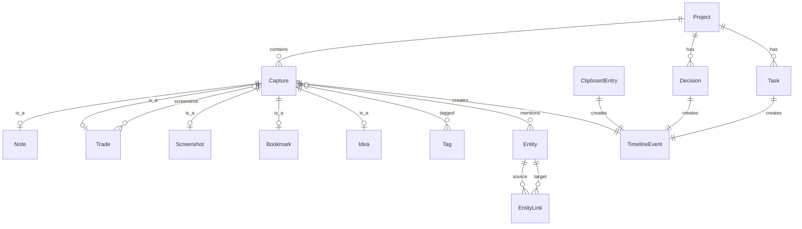

# Data Model

## Overview

All user activity flows through a unified event model. Every capture, copy, trade, and decision creates a `TimelineEvent` that powers the [Memory Timeline](../features/timeline.md).



## Core Entities

### Capture (base record)

All manual captures share a base structure. Type-specific fields live in subtype tables or a JSON `metadata` column.

```sql
CREATE TABLE captures (
    id            TEXT PRIMARY KEY,  -- UUID
    type          TEXT NOT NULL,     -- note | trade | idea | screenshot | task | bookmark
    title         TEXT,
    content       TEXT,              -- markdown body or description
    source_app    TEXT,              -- e.g. "Code", "Chrome"
    source_title  TEXT,              -- window title at capture time
    metadata      TEXT,              -- JSON: type-specific fields
    created_at    TEXT NOT NULL,     -- ISO 8601
    updated_at    TEXT NOT NULL,
    project_id    TEXT REFERENCES projects(id),
    is_deleted    INTEGER DEFAULT 0
);
```

### Note

Extends Capture with `type = 'note'`. No additional table in MVP — uses `captures` with type discrimination.

### Trade (Phase 2)

```sql
-- Stored in captures.metadata when type = 'trade'
{
    "instrument": "Gold",
    "direction": "long",       -- long | short
    "entry_price": 2345.50,
    "exit_price": 2350.00,
    "pnl": 4800,
    "currency": "INR",
    "emotion": "confidence",   -- fear | greed | confidence | neutral
    "screenshot_id": "uuid",
    "rules_followed": true,
    "notes": "Breakout above resistance"
}
```

### Screenshot

```sql
CREATE TABLE screenshots (
    id            TEXT PRIMARY KEY,
    capture_id    TEXT NOT NULL REFERENCES captures(id),
    file_path     TEXT NOT NULL,     -- relative to app data dir
    thumbnail_path TEXT,
    width         INTEGER,
    height         INTEGER,
    created_at    TEXT NOT NULL
);
```

### ClipboardEntry

```sql
CREATE TABLE clipboard_entries (
    id            TEXT PRIMARY KEY,
    text          TEXT NOT NULL,
    content_hash  TEXT NOT NULL,     -- SHA-256 for dedup
    source_app    TEXT,
    copied_at     TEXT NOT NULL,
    is_sensitive  INTEGER DEFAULT 0, -- filtered by heuristics
    is_deleted    INTEGER DEFAULT 0
);

CREATE INDEX idx_clipboard_hash ON clipboard_entries(content_hash);
CREATE INDEX idx_clipboard_copied ON clipboard_entries(copied_at);
```

### TimelineEvent

The unified activity index. Every action creates one.

```sql
CREATE TABLE timeline_events (
    id            TEXT PRIMARY KEY,
    event_type    TEXT NOT NULL,
    -- clipboard_copy | screenshot | note | trade | task | decision
    -- git_commit | browser_visit | voice_note | bookmark | idea
    timestamp     TEXT NOT NULL,
    title         TEXT NOT NULL,     -- display headline
    summary       TEXT,              -- short description for timeline card
    content_ref   TEXT NOT NULL,     -- FK to source table + id
    content_table TEXT NOT NULL,     -- captures | clipboard_entries | decisions | tasks
    source_app    TEXT,
    metadata      TEXT,              -- JSON: event-specific display data
    created_at    TEXT NOT NULL
);

CREATE INDEX idx_timeline_timestamp ON timeline_events(timestamp);
CREATE INDEX idx_timeline_type ON timeline_events(event_type);
```

### Project (Phase 2)

```sql
CREATE TABLE projects (
    id            TEXT PRIMARY KEY,
    name          TEXT NOT NULL,
    slug          TEXT NOT NULL UNIQUE,
    description   TEXT,
    color         TEXT,              -- hex color for UI
    created_at    TEXT NOT NULL,
    updated_at    TEXT NOT NULL,
    is_archived   INTEGER DEFAULT 0
);
```

### Decision (Phase 2)

```sql
CREATE TABLE decisions (
    id            TEXT PRIMARY KEY,
    project_id    TEXT NOT NULL REFERENCES projects(id),
    decision      TEXT NOT NULL,
    reason        TEXT,
    context       TEXT,              -- additional markdown
    decided_at    TEXT NOT NULL,
    created_at    TEXT NOT NULL
);
```

### Task (Phase 2)

```sql
CREATE TABLE tasks (
    id            TEXT PRIMARY KEY,
    project_id    TEXT REFERENCES projects(id),
    title         TEXT NOT NULL,
    description   TEXT,
    status        TEXT DEFAULT 'todo',  -- todo | in_progress | done
    due_date      TEXT,
    completed_at  TEXT,
    created_at    TEXT NOT NULL,
    updated_at    TEXT NOT NULL
);
```

### Tag

```sql
CREATE TABLE tags (
    id            TEXT PRIMARY KEY,
    name          TEXT NOT NULL UNIQUE,
    color         TEXT
);

CREATE TABLE capture_tags (
    capture_id    TEXT NOT NULL REFERENCES captures(id),
    tag_id        TEXT NOT NULL REFERENCES tags(id),
    PRIMARY KEY (capture_id, tag_id)
);
```

### Entity (Knowledge Graph, Phase 2)

```sql
CREATE TABLE entities (
    id            TEXT PRIMARY KEY,
    name          TEXT NOT NULL,
    type          TEXT NOT NULL,     -- project | api | rule | instrument | person | concept
    description   TEXT,
    created_at    TEXT NOT NULL
);

CREATE TABLE entity_links (
    id            TEXT PRIMARY KEY,
    source_id     TEXT NOT NULL REFERENCES entities(id),
    target_id     TEXT NOT NULL REFERENCES entities(id),
    relationship  TEXT,              -- related_to | part_of | depends_on | implements
    confidence    REAL DEFAULT 1.0,  -- 1.0 = manual, <1.0 = auto-extracted
    created_at    TEXT NOT NULL
);

CREATE TABLE capture_entities (
    capture_id    TEXT NOT NULL REFERENCES captures(id),
    entity_id     TEXT NOT NULL REFERENCES entities(id),
    PRIMARY KEY (capture_id, entity_id)
);
```

### Embedding (Vector Index)

```sql
CREATE VIRTUAL TABLE embeddings USING vec0(
    capture_id TEXT PRIMARY KEY,
    embedding float[768]           -- dimension depends on model
);
```

### Search Index

```sql
CREATE VIRTUAL TABLE captures_fts USING fts5(
    title, content, content='captures', content_rowid='rowid'
);

CREATE VIRTUAL TABLE clipboard_fts USING fts5(
    text, content='clipboard_entries', content_rowid='rowid'
);
```

## Event Type Reference

| event_type | Source Table | Trigger | Phase |
|------------|-------------|---------|-------|
| `clipboard_copy` | clipboard_entries | OS clipboard change | 1 |
| `note` | captures | Manual capture or quick note | 1 |
| `screenshot` | captures + screenshots | Hotkey or manual capture | 1 |
| `idea` | captures | Manual capture | 1 |
| `bookmark` | captures | Manual capture | 1 |
| `task` | tasks | Task create/update | 2 |
| `trade` | captures | Post-trade entry | 2 |
| `decision` | decisions | Decision logged | 2 |
| `git_commit` | external | Git hook / MCP | 3 |
| `browser_visit` | external | Browser extension / MCP | 3 |
| `voice_note` | captures | Voice recording | 3 |

## TimelineEvent Examples

### Clipboard Copy

```json
{
    "id": "evt_001",
    "event_type": "clipboard_copy",
    "timestamp": "2026-05-21T09:12:00Z",
    "title": "Copied: docker compose up",
    "summary": "docker compose up -d --build",
    "content_ref": "clip_abc123",
    "content_table": "clipboard_entries",
    "source_app": "Terminal",
    "metadata": {}
}
```

### Trade

```json
{
    "id": "evt_002",
    "event_type": "trade",
    "timestamp": "2026-05-21T10:32:00Z",
    "title": "Gold Long +₹1,200",
    "summary": "Breakout trade, confidence",
    "content_ref": "cap_trade456",
    "content_table": "captures",
    "source_app": "Aura",
    "metadata": {
        "instrument": "Gold",
        "direction": "long",
        "pnl": 1200,
        "emotion": "confidence"
    }
}
```

## Data Lifecycle

| Stage | Behavior |
|-------|----------|
| Create | Capture → DB insert → TimelineEvent → embedding → FTS index |
| Update | Modify record → re-index embedding and FTS |
| Delete | Soft delete (`is_deleted = 1`) — hidden from UI and search |
| Export | Full SQLite dump or JSON export per entity type |
| Sync | Change log entry → delta to cloud (Phase 2) |

## Related Docs

- [Timeline Feature](../features/timeline.md)
- [Capture Pipeline](capture-pipeline.md)
- [Architecture Overview](overview.md)
- [MVP Scope](../product/mvp.md)
