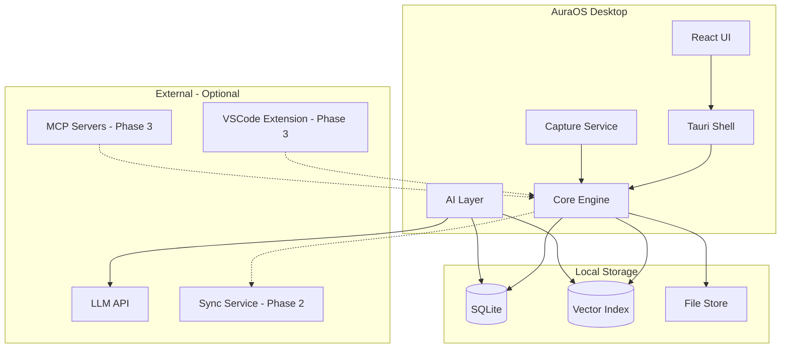
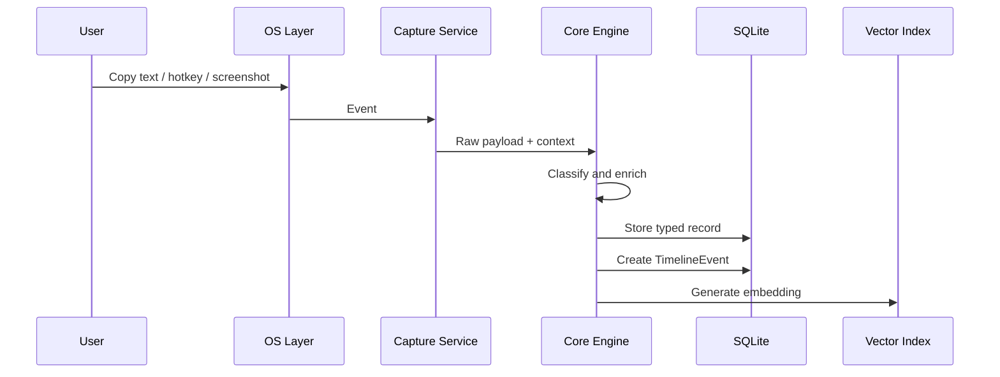
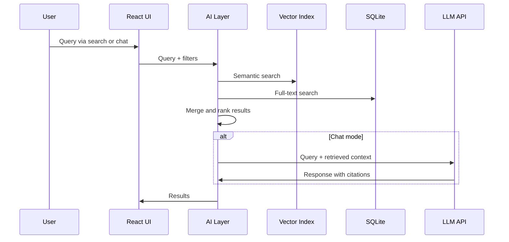

# Architecture Overview

## System Context

AuraOS is a cross-platform desktop application. **Phase 1** ships the VRM character overlay; **Phase 2** adds the capture service, local database, and memory platform; **Phase 3** adds external integrations.



## Module Boundaries

```
aura/
├── src-tauri/          # Rust backend
│   ├── capture/        # Clipboard, screenshot, hotkey hooks
│   ├── core/           # Business logic, timeline, entities
│   ├── db/             # SQLite access, migrations
│   ├── ai/             # Embeddings, RAG, LLM client
│   ├── character/      # VRM renderer, physics, window anchors (Phase 1)
│   └── sync/           # Cloud sync (Phase 2)
├── src/                # React frontend
│   ├── components/     # Shared UI components
│   ├── routes/         # Page-level views
│   ├── hooks/          # Data fetching, hotkeys
│   └── stores/         # Client state
└── docs/               # Planning documentation
```

### capture/

Platform-specific OS hooks for passive and active capture.

- Clipboard monitor (continuous)
- Global hotkey registration
- Screenshot capture
- Active window / app detection
- Voice recording (Phase 3)

### core/

Business logic independent of UI.

- Capture classification and routing
- TimelineEvent creation
- Entity extraction and linking
- Search indexing
- Trading metrics calculation
- Focus mode rules engine

### db/

SQLite persistence layer.

- Schema migrations
- CRUD operations for all entities
- Full-text search (FTS5)
- Transaction management

### ai/

AI and retrieval layer.

- Embedding generation on capture save
- Vector similarity search
- RAG pipeline for chat and search
- LLM provider abstraction (OpenAI, Anthropic, local)

### sync/ (Phase 2)

Hybrid cloud sync.

- Change log and delta sync
- Conflict resolution
- E2E encryption
- See [Sync](sync.md)

### character/ (Phase 1)

VRM character engine and desktop physics.

- VRM rendering (Three.js)
- Window anchor and pathfinding
- Animation state machine
- Click interaction handler
- Spawnable object system
- See [Character Engine](character-engine.md)

## Data Flow

### Capture Flow



### Search Flow



## Deployment Model

### Phase 1: Character Overlay

- Tauri binary with transparent fullscreen overlay per monitor
- VRM character rendering and window physics
- Minimal SQLite for character config and preferences
- Character picker at onboarding

### Phase 2: Memory Platform

- Main app window with sidebar navigation
- Background clipboard capture in system tray
- Full SQLite database + vector index
- Optional cloud sync (hybrid, user opt-in)
- App data directory:
  - Linux: `~/.local/share/aura/`
  - macOS: `~/Library/Application Support/aura/`
  - Windows: `%APPDATA%\aura\`

### Phase 3: Extensions

- VSCode extension communicates via local IPC/socket
- MCP servers connect to capture API
- Event-driven character coaching

## Security

| Concern | Approach |
|---------|----------|
| Data at rest | Optional SQLite encryption (SQLCipher) |
| Clipboard secrets | Heuristic filtering — skip passwords, API keys, credit cards |
| LLM privacy | User's own API key; only retrieved context sent to LLM |
| Cloud sync | E2E encryption; server sees ciphertext only |
| Local access | OS file permissions; no network exposure in MVP |

## Cross-Platform Considerations

| Capability | Linux | macOS | Windows |
|------------|-------|-------|---------|
| Clipboard monitor | X11/Wayland APIs | NSPasteboard | Win32 clipboard |
| Global hotkeys | xdotool / portal | Carbon/Cocoa | RegisterHotKey |
| Screenshot | portal / scrot | screencapture | BitBlt |
| Active window | wmctrl / portal | NSWorkspace | GetForegroundWindow |
| System tray | libappindicator | NSStatusItem | Shell_NotifyIcon |

Rust crates and Tauri plugins abstract most platform differences. Platform-specific code isolated in `capture/platform/`.

## Related Docs

- [Tech Stack](tech-stack.md)
- [Data Model](data-model.md)
- [Capture Pipeline](capture-pipeline.md)
- [Sync](sync.md)
- [ADR: Use Tauri](../adr/0002-use-tauri-for-desktop.md)
