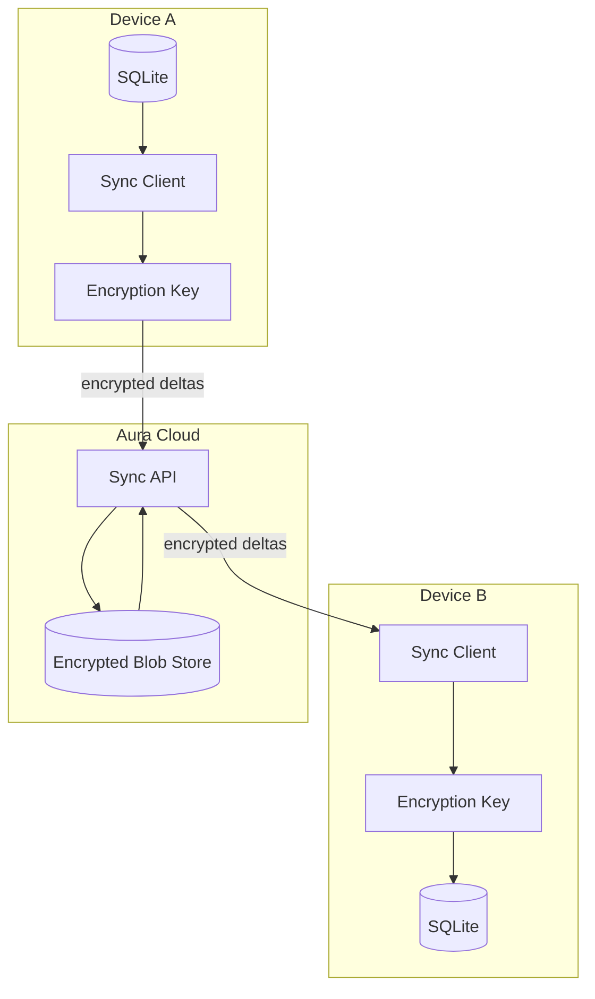
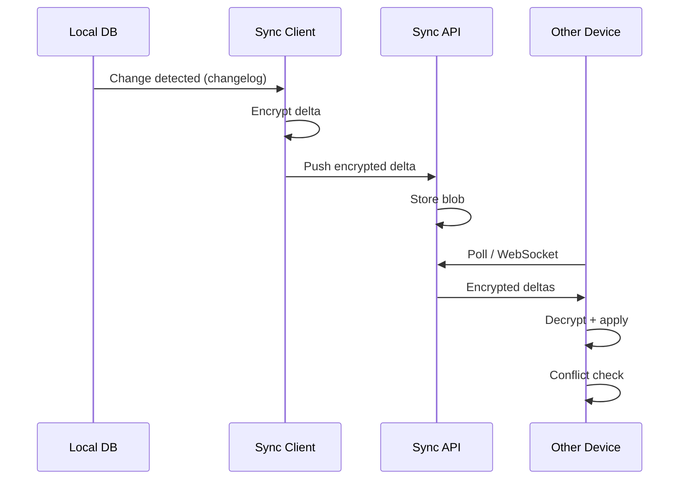

# Hybrid Sync

**Phase 2+**

Optional cloud sync for AuraOS. Local remains the source of truth; sync is additive and encrypted.

## Overview

AuraOS stores character config locally from Phase 1. Phase 2 adds the full memory database; optional cloud sync lets users access memory across devices with E2E encryption.

**Principles:**

1. Local-first — app works fully offline, sync is optional
2. E2E encrypted — server sees ciphertext only
3. User owns their data — export and delete anytime
4. Opt-in — no account required for core features

## Architecture



## Sync Model

### What Syncs

| Data | Syncs | Notes |
|------|-------|-------|
| Captures (notes, ideas, trades) | Yes | E2E encrypted |
| Screenshots | Yes | Encrypted file blobs |
| Clipboard entries (non-sensitive) | Yes | Sensitive entries never sync |
| Timeline events | Yes | Derived from captures |
| Projects, decisions, tasks | Yes | |
| Tags, entities, links | Yes | |
| Settings (preferences) | Optional | User choice |
| LLM API keys | No | Device-local only |
| Sensitive/vault entries | No | Never leave device |
| Embeddings | Optional | Can regenerate locally |

### What Does NOT Sync

- `is_sensitive = 1` clipboard entries
- Vault contents
- API keys and credentials
- Local embedding cache (regenerated on device)
- Companion position/preferences (device-specific)

## Protocol

### Change Log

Each local change appends to a `sync_changelog` table:

```sql
CREATE TABLE sync_changelog (
    id            INTEGER PRIMARY KEY AUTOINCREMENT,
    table_name    TEXT NOT NULL,
    record_id     TEXT NOT NULL,
    operation     TEXT NOT NULL,  -- insert | update | delete
    changed_at    TEXT NOT NULL,
    synced        INTEGER DEFAULT 0
);
```

### Sync Flow



### Delta Format

```json
{
    "device_id": "uuid",
    "timestamp": "2026-05-21T14:00:00Z",
    "changes": [
        {
            "table": "captures",
            "id": "cap_123",
            "operation": "insert",
            "ciphertext": "base64...",
            "nonce": "base64..."
        }
    ]
}
```

## Encryption

| Layer | Method |
|-------|--------|
| Transport | TLS 1.3 |
| At rest (cloud) | Server-side encryption (AES-256) |
| E2E payload | libsodium secretbox (XSalsa20-Poly1305) |
| Key derivation | Argon2id from user passphrase |
| Key storage | OS keychain (device) |

### Key Management

1. User creates Aura account (email + passphrase)
2. Passphrase derives encryption key via Argon2id
3. Key stored in OS keychain on each device
4. Recovery key generated for passphrase loss
5. Key never sent to server

## Conflict Resolution

### Strategy: CRDT with Last-Writer-Wins Fallback

| Scenario | Resolution |
|----------|------------|
| Same record edited on two devices offline | CRDT merge (Automerge or custom) |
| Delete vs edit conflict | Delete wins |
| Tag/entity merge | Union of both sets |
| Unresolvable conflict | Last-writer-wins by `updated_at` timestamp |

### Conflict UI

Rare conflicts surfaced to user:

```
┌──────────────────────────────────────────────────┐
│  Sync Conflict                                    │
├──────────────────────────────────────────────────┤
│  "Sentinel API design" was edited on two devices  │
│                                                    │
│  Device A (May 21, 14:00):                        │
│  "Updated endpoint to v2..."                      │
│                                                    │
│  Device B (May 21, 14:05):                        │
│  "Added rate limit notes..."                      │
│                                                    │
│  [Keep A]  [Keep B]  [Keep Both]                   │
└──────────────────────────────────────────────────┘
```

## API Design

### Endpoints

| Method | Path | Description |
|--------|------|-------------|
| POST | `/auth/register` | Create account |
| POST | `/auth/login` | Get device token |
| POST | `/sync/push` | Push encrypted deltas |
| GET | `/sync/pull?since=timestamp` | Pull deltas since timestamp |
| WS | `/sync/stream` | Real-time delta stream |
| DELETE | `/account` | Delete all cloud data |

### Authentication

- OAuth2 device flow
- Device tokens (long-lived, revocable)
- No password stored on server (passphrase → key derivation only)

## Settings UI

```
┌──────────────────────────────────────────────────┐
│  Sync Settings                                    │
├──────────────────────────────────────────────────┤
│                                                    │
│  Account: viraj@example.com         [Sign Out]    │
│  Status: ✓ Synced · Last sync: 2 min ago          │
│                                                    │
│  ☑ Sync captures and notes                        │
│  ☑ Sync screenshots                               │
│  ☑ Sync clipboard history                         │
│  ☐ Sync settings across devices                   │
│                                                    │
│  Encryption: E2E (passphrase-protected)            │
│  [Change Passphrase]  [Show Recovery Key]          │
│                                                    │
│  Devices:                                          │
│  • Laptop (Linux) — active now                     │
│  • Desktop (macOS) — last sync 1 hr ago            │
│                                                    │
│  [Export All Data]  [Delete Cloud Data]            │
│                                                    │
└──────────────────────────────────────────────────┘
```

## Performance

| Metric | Target |
|--------|--------|
| Push latency | < 2 seconds |
| Pull latency | < 3 seconds |
| Initial sync (10K records) | < 60 seconds |
| Background sync interval | 30 seconds (configurable) |
| Offline queue | Unlimited (sync on reconnect) |

## Privacy Guarantees

1. Server cannot read user data (E2E encryption)
2. Sensitive entries never sync
3. User can delete all cloud data instantly
4. No analytics on synced content
5. Open-source sync client (verifiable encryption)

## Phase

| Capability | Phase |
|------------|-------|
| Local-only (no sync) | 2 |
| Account creation + E2E sync | 2 |
| Multi-device sync | 2 |
| Conflict resolution UI | 2 |
| Real-time sync (WebSocket) | 2 |
| Selective sync (per data type) | 2 |
| Shared projects (collaboration) | Future |

## Open Questions

- Self-hosted sync server option?
- Sync provider: custom vs existing (e.g., Electric SQL, PowerSync)?
- Free tier storage limits?
- Sync clipboard across devices — privacy concern?
- Offline conflict rate at personal scale — is CRDT overkill?

## Related Docs

- [Data Model](data-model.md)
- [Tech Stack](tech-stack.md)
- [Architecture Overview](overview.md)
- [MVP Scope](../product/mvp.md)
