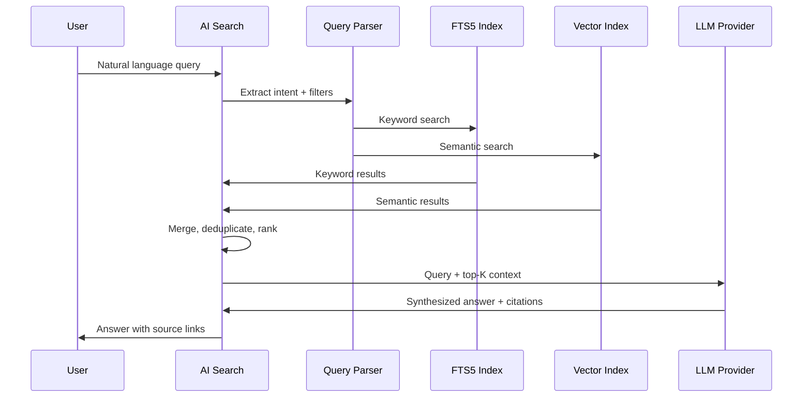

# AI Search

**Phase 2**

Natural-language search across your entire digital memory. The killer feature powered by everything else.

## Overview

Instead of folders and tags, ask Aura questions in plain language. AI Search combines full-text search, vector similarity, and LLM synthesis to find and explain information from your captures, clipboard, trades, and decisions.

## User Stories

1. As a user, I want to ask "what commands did I copy for Sentinel deployment?" and get cited answers
2. As a trader, I want to find "all Gold trades where I felt fear"
3. As a developer, I want to ask "why did we use aggregates?" and get the decision record
4. As a user, I want to find "architecture screenshot from April" without remembering the exact date
5. As a user, I want search results with sources I can click to verify

## Example Queries

| Query | Expected Result |
|-------|----------------|
| "Show all Gold trades where I felt fear" | Trade captures filtered by instrument + emotion |
| "What AWS commands did I use for Sentinel deployment?" | Clipboard entries + notes with AWS commands |
| "Find architecture screenshot from April" | Screenshot captures from April, semantic match |
| "What was I doing on May 21?" | Timeline summary for that day |
| "Why did we use Postgres aggregates?" | Decision record with reason and context |
| "Show command copied last week" | Clipboard entries from last 7 days |
| "What notes mention Clover API?" | Notes with entity/tag match + semantic search |

## UX

### Search Bar (Global)

Available in:
- Command Palette (`Ctrl+K`)
- AI Chat (`/chat`)
- Timeline search bar
- Home screen

### Results Display

```
┌──────────────────────────────────────────────────┐
│  🔍 "AWS commands for Sentinel deployment"        │
├──────────────────────────────────────────────────┤
│                                                    │
│  Answer:                                           │
│  You used these AWS commands for Sentinel:         │
│                                                    │
│  1. aws eks update-kubeconfig --region ap-south-1  │
│  2. docker compose up -d --build                   │
│  3. kubectl apply -f sentinel-rules.yaml           │
│                                                    │
│  Sources:                                          │
│  📋 clipboard · May 21 · Terminal                  │
│  📋 clipboard · May 20 · Terminal                  │
│  📝 note · May 19 · "Deployment steps"             │
│                                                    │
└──────────────────────────────────────────────────┘
```

### Filters

| Filter | Options |
|--------|---------|
| Type | All, Notes, Clipboard, Trades, Screenshots, Tasks |
| Date | Today, Yesterday, Last 7 days, Last 30 days, Custom |
| Project | Sentinel, IdeaForge, Client A, ... |
| Emotion | Fear, Greed, Confidence (trades only) |
| Tags | User-defined tags |

## RAG Pipeline



### Query Parsing

Extract structured filters from natural language:

| Query Fragment | Parsed Filter |
|---------------|---------------|
| "Gold trades" | `type=trade, instrument=Gold` |
| "last week" | `date_range=7d` |
| "felt fear" | `emotion=fear` |
| "from April" | `date_range=2026-04` |
| "Sentinel" | `project=Sentinel OR entity=Sentinel` |

Parser: rule-based in MVP, LLM-assisted in Phase 2.

### Ranking

Results ranked by:

1. **Relevance** — vector similarity score
2. **Keyword match** — FTS5 rank
3. **Recency** — newer captures score higher
4. **Type priority** — user-specified or inferred (e.g., "commands" → clipboard first)

### Context Window

- Top 10 results injected into LLM prompt
- Each result: title, content snippet (500 chars), metadata, timestamp
- Sensitive entries (`is_sensitive = 1`) excluded
- Total context budget: ~4000 tokens

## Data Sources

All entities indexed for search:

| Source | Index | Phase |
|--------|-------|-------|
| Captures (notes, ideas, trades) | FTS5 + vector | 2 |
| Clipboard entries | FTS5 + vector | 2 |
| Screenshots (captions) | FTS5 + vector | 2 |
| Decisions | FTS5 + vector | 2 |
| Tasks | FTS5 | 2 |
| Timeline events | Metadata search | 2 |

## AI Behavior

### Answer Style

- Concise, direct answers with bullet points
- Always cite sources with clickable links
- Say "I don't have information about that" when no results found
- For ambiguous queries, ask clarifying question

### Chat Mode vs Search Mode

| Mode | Behavior |
|------|----------|
| Search | Single query → results list + brief answer |
| Chat | Multi-turn conversation with memory; each turn re-searches |

Chat available at `/chat` route. Search available everywhere.

## Performance

| Metric | Target |
|--------|--------|
| FTS5 search | < 100ms |
| Vector search | < 500ms |
| Full RAG pipeline (with LLM) | < 3 seconds |
| Embedding generation (on save) | < 200ms (async) |

## Privacy

- All search runs locally (FTS5 + vector index on device)
- Only retrieved context snippets sent to LLM API
- `is_sensitive` entries never included in LLM context
- User controls LLM provider and can use local models (Ollama)

## Phase

| Capability | Phase |
|------------|-------|
| Full-text search | 2 |
| Vector semantic search | 2 |
| RAG answers with citations | 2 |
| Query intent parsing | 1 (rules), 2 (LLM) |
| Chat mode | 2 |
| Filter UI | 2 |
| Graph-informed search | 2 |
| Timeline-aware queries | 2 |

## Open Questions

- Local LLM (Ollama) quality sufficient for RAG answers?
- Search history — show recent queries?
- Saved searches / alerts ("notify when new Gold trade logged")?
- Multi-language search support?

## Related Docs

- [Timeline](timeline.md)
- [Clipboard Timeline](clipboard-timeline.md)
- [Command Palette](command-palette.md)
- [Tech Stack](../architecture/tech-stack.md)
- [Data Model](../architecture/data-model.md)
