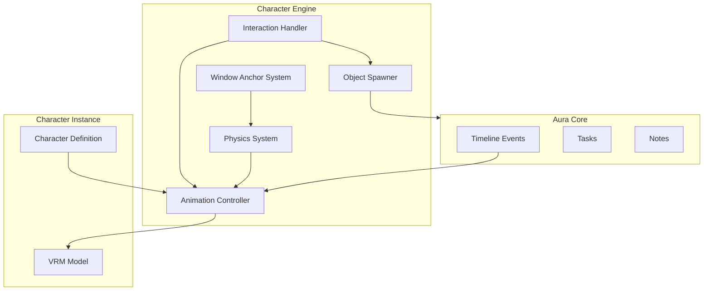
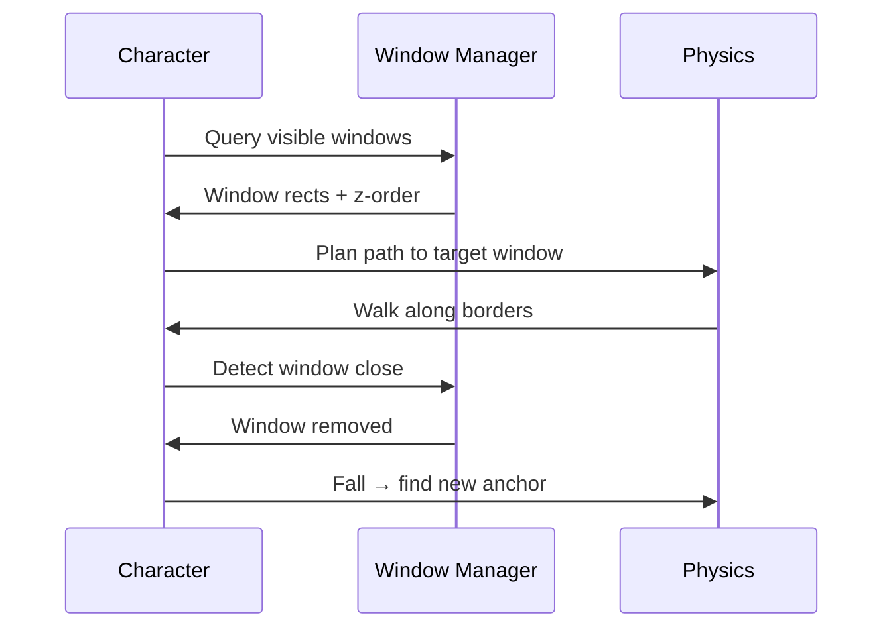

# Character Physics & Animation Framework

**Phase 1**

Every character shares a common animation and physics framework. Individual characters override behaviors, tricks, and spawn objects — but the engine is unified.

## Overview

Characters live on the desktop with real physical presence:

- Sit on window borders and taskbars
- Walk across multiple monitors
- Hide behind applications
- React to cursor, system events, and Aura data
- Spawn useful objects onto the desktop



## Core Activities

All characters implement this shared animation set. Characters may have unique variants (Mochi wags tail on `Celebrate`; Nova pulses glow).

| Activity | Trigger | Duration | Notes |
|----------|---------|----------|-------|
| **Sit** | Idle on surface | Loop | Default resting on window border |
| **Sleep** | System idle > 30 min | Loop | Character-specific sleep pose |
| **Walk** | Moving to target | Variable | Pathfinding across desktop |
| **Run** | Chasing cursor / urgent | Variable | Faster walk, used by Mochi |
| **Jump** | Celebrate, surface change | 0.5–1s | Arc physics |
| **Wave** | Single click | 1s | Greeting animation |
| **Dance** | Long press / achievement | 2–4s | Character-specific |
| **Fall** | Lost anchor / pushed | 0.5s | Gravity until new anchor |
| **Roll** | Playful idle | 1–2s | Mochi, Bobo variants |
| **Look Around** | Idle ambient | 2–3s | Head tracking |
| **Follow Cursor** | User preference / character | Continuous | Mochi chases, Orb floats toward |
| **Celebrate** | Task complete, trade win | 2s | Jump + character trick |
| **Cry** | Trade loss, compile fail | 2s | Slumped posture |
| **Think** | AI query in progress | Loop | Pondering pose |
| **Read** | Journal open | Loop | Sakura reads book |
| **Eat** | Feed treat interaction | 1.5s | Mochi treat animation |
| **Stretch** | Break reminder | 2s | After 90 min focus |
| **Hide** | Behind window | Loop | Pixel hides behind windows |
| **Peek** | Emerges from behind | 1s | Curious look |

### Animation Blending

- Locomotion blends: Walk ↔ Run ↔ Sit
- Emotional overlays: Celebrate/Cry/Think layer on top of Sit
- Interrupts: Click reactions interrupt ambient, then return to previous state

## Window Physics

Characters interact with the real desktop geometry.

### Anchor Points

Characters detect and attach to OS window surfaces:

| Surface | Behavior | Example |
|---------|----------|---------|
| **Window top border** | Sit, walk along edge | Mochi sleeps on Chrome tab bar |
| **Window corner** | Hang, peek | Pixel hangs upside down from corner |
| **Title bar** | Sit, climb | Pixel climbs title bars |
| **Dock / taskbar** | Sit, walk | Mochi sits on taskbar |
| **Menu bar** | Hang, perch | Pixel sleeps on macOS menu bar |
| **Desktop icons** | Bounce across | Bobo bounces on icons |
| **Screen edge** | Patrol, sleep | Multi-monitor border patrol |

### Multi-Window Navigation



| Action | Description |
|--------|-------------|
| **Sit on** | Browser tabs, window borders, dock, taskbar |
| **Hang from** | Window corners, menu bars |
| **Walk across** | Traverse multiple windows left-to-right |
| **Hide behind** | Z-order aware — character occluded by foreground app |
| **Slide down** | Gravity slide along window edge when anchor lost |
| **Bounce on** | Desktop icons with squash/stretch (Bobo) |

### Multi-Monitor

- Mochi special trick: runs across all monitors chasing cursor
- Character position tracked in global desktop coordinates
- Monitor hotplug: character re-anchors to nearest window

### System Event Reactions

| Event | Physics Response | Character Example |
|-------|-----------------|-------------------|
| CPU > 80% | Wheel spin animation | Nibbles runs in wheel |
| Window minimized | Fall → find new anchor | All |
| New window opened | Look toward, optional walk | Pixel peeks |
| Monitor sleep | Character sleeps | All |
| Battery low | Yawn, stretch | Sakura |

## Click Interactions

Three levels, consistent across all characters.

### Single Click — Mini Reaction

Quick feedback. Does not open UI.

| Character | Reaction |
|-----------|----------|
| Mochi | Bark + tail wag |
| Pixel | Nibble animation |
| Sakura | Wave + blush |
| Nova | Glow pulse |
| Ember | Tiny fire puff |
| Orb | Pulse ripple |
| Chiku | Funny face |

Duration: 0.5–1.5 seconds, then return to ambient.

### Double Click — Contextual Widget

Opens an Aura feature panel anchored near the character.

| Character | Widget |
|-----------|--------|
| Mochi | Quick Notes |
| Mochi (alt) | Today's tasks |
| Pixel | Clipboard history |
| Sakura | Journal |
| Nova | AI search |
| Ember | Trading chart board |
| Yuki | Project notes |
| Jarv | System monitor |
| Ganesha | Knowledge vault |

Widgets are semi-transparent overlays, not full app navigation.

### Long Press — Special Ability

Premium interaction. Hold 800ms+.

| Character | Ability |
|-----------|---------|
| Mochi | Fetch note — character retrieves a timeline note |
| Sakura | Cherry blossom dance + journal prompt |
| Nova | Holographic dashboard — full memory summary |
| Ember | Open vault |
| Dragon | Breathe fire + vault animation |
| Hanuman | Activate focus mode |
| Chiku | Moonwalk + random funny comment |

## Spawnable Objects

Characters materialize useful desktop objects. Objects are interactive Aura widgets styled to match the character.

| Object | Description | Aura Feature | Characters |
|--------|-------------|--------------|------------|
| **Sticky Note** | Thrown onto desktop, stays pinned | Quick capture | Mochi, Chiku, Sakura |
| **Task Card** | Floating reminder card | Tasks | Mochi, Akira |
| **Mini Calendar** | Shows today's schedule | Timeline / tasks | Sakura |
| **Memory Orb** | Glowing orb with recent notes | AI search preview | Nova, Orb |
| **Treasure Chest** | Achievement unlock animation | Streaks, milestones | Akira, Ember |
| **Chart Board** | Trading stats display | Trading workspace | Ember |
| **Terminal Screen** | Floating terminal aesthetic | Dev snippets, clipboard | Yuki, Jarv |

### Spawn Behavior

1. Character plays throw/summon animation
2. Object appears with physics (arc trajectory for thrown objects)
3. Object pins to desktop until dismissed or task completed
4. Click object → opens full Aura feature
5. Auto-dismiss after configurable timeout (default: persistent until closed)

```typescript
interface SpawnableObject {
  type: 'sticky_note' | 'task_card' | 'mini_calendar' | 'memory_orb'
       | 'treasure_chest' | 'chart_board' | 'terminal_screen';
  position: { x: number; y: number };
  anchor: 'desktop' | 'window' | 'character';
  payload: Record<string, unknown>;  // note content, task id, etc.
  character_id: string;
  expires_at?: string;
}
```

## Character Definition Schema

Each character is a config file + VRM model:

```json
{
  "id": "mochi",
  "name": "Mochi",
  "category": "cute_animals",
  "model": "mochi.vrm",
  "scale": 0.8,
  "personality_prompt": "Friendly shiba puppy. Enthusiastic, loyal...",
  "behaviors": {
    "ambient": ["sit", "look_around", "follow_cursor"],
    "idle_sleep": "sleep_curled",
    "celebrate": "jump_wag_tail",
    "follow_cursor": true,
    "multi_monitor_chase": true
  },
  "interactions": {
    "single_click": "bark",
    "double_click": "open_quick_notes",
    "long_press": "fetch_note"
  },
  "spawn_objects": ["sticky_note", "task_card"],
  "special_tricks": ["multi_monitor_chase", "bring_note_in_mouth"],
  "window_physics": {
    "preferred_anchors": ["window_border", "taskbar"],
    "can_hang": false,
    "can_hide_behind": false
  }
}
```

## Performance Targets

| Metric | Target |
|--------|--------|
| Render FPS | 60fps (VRM on GPU) |
| CPU overhead | < 3% idle, < 8% active animation |
| Memory | < 150MB per character instance |
| Window query rate | 5Hz (not per-frame) |
| Click response | < 100ms to first animation frame |

## Accessibility

- Reduce motion mode: disable chase, fall, bounce — static sit + speech bubbles
- Hide character per-app (presentations, screen share)
- Keyboard shortcuts mirror all double-click actions
- High contrast spawn objects option

## Related Docs

- [Character Platform](character-platform.md)
- [Character Roster](../product/character-roster.md)
- [Character Engine](../architecture/character-engine.md)
- [Companion Layer](companion-layer.md)
