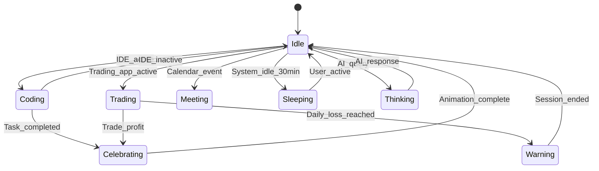

# Companion Layer

**Phase 1 (VRM + Physics) · Phase 3 (Intelligence)**

The visible character that reacts to your digital life. Not cosmetic — the emotional interface to your memory.

## Overview

The Companion is a persistent character that reflects what you're doing and how you're doing. It transitions between states based on your activity, provides emotional feedback, and in later phases, actively coaches you during focus and trading sessions.

**Philosophy:** The companion is the interface, not the product. Users open Aura to remember and act — the character makes memory feel alive.

**Platform vision:** Characters become the UI for your second brain. See [Character Platform](character-platform.md) for the full roster, physics, and launch lineup (Mochi, Pixel, Sakura, Nova, Ember).

## User Stories

1. As a user, I want visual feedback when something goes wrong (compile fail) or right (trade target hit)
2. As a trader, I want the companion to block my dashboard when I hit my daily loss limit
3. As a user, I want a character that reflects my current activity (coding, trading, meeting)
4. As a user, I want to choose a companion personality that matches my workflow (Phase 1)
5. As a user, I want the companion visible but not distracting during deep work

## States

| State | Trigger | Visual |
|-------|---------|--------|
| **Idle** | No activity detected | Relaxed, ambient animation |
| **Thinking** | AI query in progress | Pondering pose |
| **Coding** | VSCode/IDE active | Typing, focused |
| **Trading** | Trading platform active | Alert, watchful |
| **Meeting** | Calendar event / video call app | Listening pose |
| **Sleeping** | System idle > 30 min | Eyes closed, Zzz |
| **Celebrating** | Trade target hit, task completed | Jumping, confetti |
| **Warning** | Daily loss reached, rule violation | Arms crossed, blocking |

## Reaction Examples

| Event | State Transition | Action |
|-------|-----------------|--------|
| Compilation fails | → Disappointed | Slumped posture, sigh animation |
| Trade hits target | → Celebrating | Jump + confetti for 3 seconds |
| Daily loss reached | → Warning | Blocks trading dashboard |
| 90 min coding session | → Coding → Idle | "Time for a break" speech bubble |
| New capture saved | → Brief celebration | Thumbs up flash |
| AI search running | → Thinking | Pondering until response |

## UX

### Phase 1: VRM Character (Launch)

- Transparent overlay window covering desktop
- Full 3D VRM characters with window physics (sit on borders, chase cursor, hide behind windows)
- Shared animation framework: Sit, Walk, Run, Celebrate, Dance, and 14 more core activities
- 3-level interactions: single click (reaction), double click (widget), long press (special ability)
- Spawnable desktop objects: sticky notes, task cards, memory orbs, chart boards
- Launch lineup: Mochi, Pixel, Sakura, Nova, Ember
- Character onboarding picker
- Personality system (LLM tone per character)
- Basic state machine (Idle, Celebrate, Think, Warning)

See [Character Platform](character-platform.md), [Character Physics](character-physics.md), [Character Roster](../product/character-roster.md).

### Phase 2: Data Wiring

- Character double-clicks open live Aura features (notes, clipboard, search, trading)
- Spawn objects populated with real capture data

### Phase 3: Intelligent Coaching

- Event-driven reactions (compile fail, trade target, daily loss)
- Focus mode integration with character enforcement
- Advanced coaching per character personality

## State Machine



## Data Entities

Companion state is runtime — not persisted. Configuration stored in settings:

```json
{
    "companion_enabled": true,
    "companion_position": { "x": 1800, "y": 900 },
    "companion_opacity": 0.85,
    "companion_personality": "default",
    "reaction_preferences": {
        "trade_celebration": true,
        "break_reminders": true,
        "loss_warnings": true
    }
}
```

## AI Behavior

- Speech bubble messages generated by LLM with personality prompt
- Context-aware coaching: references user's rules, recent activity
- Personality templates (Phase 1): per-character LLM tone in onboarding

## Phase

| Capability | Phase 1 | Phase 2 | Phase 3 |
|------------|---------|---------|---------|
| VRM character + physics | ✓ | | |
| Launch lineup (5) | ✓ | | |
| Basic state machine | ✓ | | |
| Widgets wired to real data | | ✓ | |
| Speech bubbles + coaching | | | ✓ |
| Trading dashboard block | | | ✓ |
| Event-driven reactions | | | ✓ |
| Character marketplace | ✓ | | |

## Open Questions

- Default launch character: Mochi (broadest appeal) or user picks at onboarding?
- Should companion be hideable per-app (e.g., hidden during presentations)?
- Voice output (TTS) per character personality?
- User-uploaded VRM at marketplace launch?

## Related Docs

- [Character Platform](character-platform.md) — Characters as UI, launch lineup
- [Character Physics](character-physics.md) — Animation framework, window physics
- [Character Roster](../product/character-roster.md) — All character specs
- [Character Engine](../architecture/character-engine.md) — VRM rendering, technical design
- [Focus Mode](focus-mode.md)
- [Trading Workspace](trading-workspace.md)
- [Vision](../product/vision.md) — Companion philosophy
